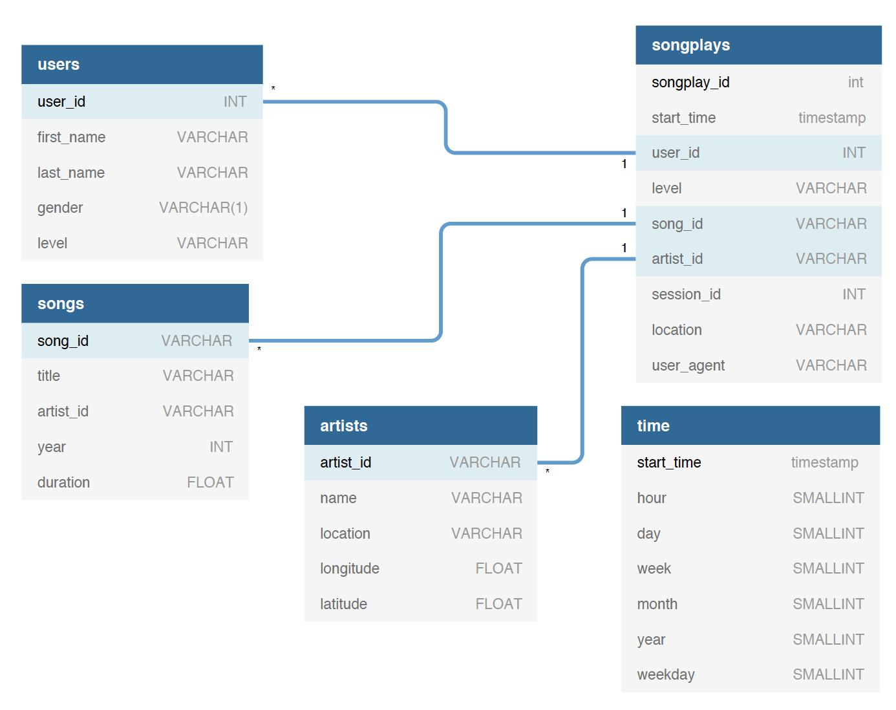

# Purpose

Building a data warehouse and data pipelines for analysing songs played by users. In this project we automate and monitor the data warehouse ETL pipeline using [Airflow](https://airflow.apache.org/).

# Database Design

The database uses start schema model. There is only one fact table, **songplays**, and four dimenstion tables, **users, songs, artists, and time**.

# ETL Process

The source data resides in Amazon S3 and needs to be processed in Sparkify's 
data warehouse in Amazon Redshift. The source datasets consist of JSON 
logs that tell about user activity in the application and JSON metadata 
about the songs the users listen to.
