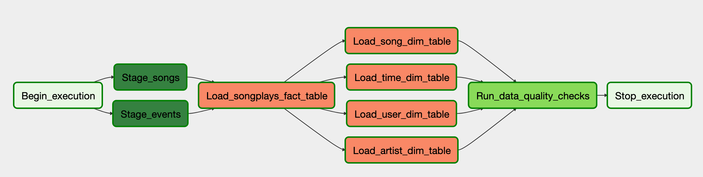

# Purpose

Building a data warehouse and data pipelines for analysing songs played by users. In this project we automate and monitor the data warehouse ETL pipeline using [Airflow](https://airflow.apache.org/).

# Database Design

The database uses start schema model. There is only one fact table, **songplays**, and four dimenstion tables, **users, songs, artists, and time**.

# Data Pipeline

The source data resides in Amazon S3 and needs to be extracted, transformed, and loaded in Redshift.  The source datasets consist of JSON logs that tell about user activity in the application and JSON songs metadata.

# How to run the project

## Airflow Installation

Firrst, you have to install [Apache Airflow]([Installation &mdash; Airflow Documentation](https://airflow.apache.org/docs/stable/installation.html)). 

1. Install apache airflow with postgress `pip install apache-airflow[postgres]`

2. Initialize Airflow database`airflow initdb`

Once you have installed Airflow, place the project under the DAGs folder references in your `airflow.cfg` flle. The default location for your DAGs is `~/airflow/dags`.

Now run Airflow using these commands:

`airflow scheduler --daemon`

`airflow webserver --daemon -p 3000`

After doing that, you will be able to access Airflow UI under `http://localhost:3000`.

## Variables and Connections

Create  configuration variables and connections in airflow (use udacity page)

There are 4 variables and 2 connections that are needed to be configured.

Go to Airflow UI. From the Admin menu in the top menu bar, select `Variables`. Create these Variables:

- `s3_bucket` which holds the AWS S3 bucket

- `s3_log_key` which holds the log files key

- `s3_song_key` which holds the song files key

- `s3_log_json_path_key` which holds the ''log JSON path file' key

Then, from the same Admin menu, select `Connections`. Create these Connections:

* `aws_credentials` of type `Amazon Web Services`

* `redshift` of type `Postgres`

## Creating Tables

Ceate the tables that are defined in `create_table.sql` in your Redshift cluster.

Finally, after completing these steps, you should be able to turn the Dag on using the Airflow UI.
